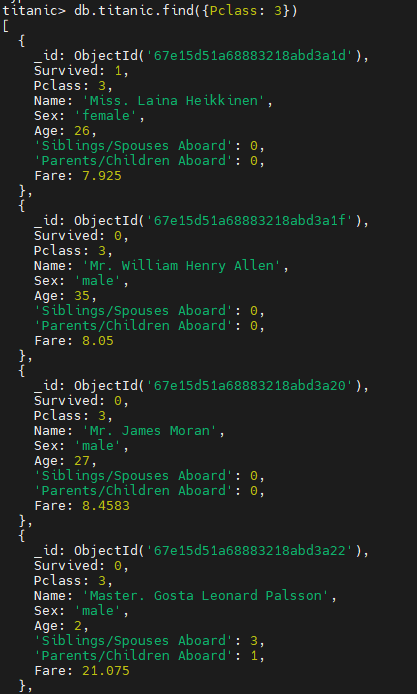

# Описание/Пошаговая инструкция выполнения домашнего задания

Необходимо:

* установить MongoDB одним из способов: ВМ, докер;
* заполнить данными;
* написать несколько запросов на выборку и обновление данных

## Установка (ubuntu)

```
curl -fsSL https://pgp.mongodb.com/server-7.0.asc | sudo gpg -o /usr/share/keyrings/mongodb-server-7.0.gpg --dearmor
echo "deb [ arch=amd64,arm64 signed-by=/usr/share/keyrings/mongodb-server-7.0.gpg ] https://repo.mongodb.org/apt/ubuntu jammy/mongodb-org/7.0 multiverse" | sudo tee /etc/apt/sources.list.d/mongodb-org-7.0.list
apt update
apt install mongodb-org
```

```
mongod --version
```


## Загрузка датасета

Возьмем с этого сайта

[datasets](https://habr.com/ru/companies/edison/articles/480408/)   
[Titanic](https://web.stanford.edu/class/archive/cs/cs109/cs109.1166/problem12.html)

```
wget https://web.stanford.edu/class/archive/cs/cs109/cs109.1166/stuff/titanic.csv
```

Создадим базу и сделаем ипорт из csv файла

```sql
use titanic
db.createCollection("titanic")
```

```
mongoimport --db titanic --collection titanic --type csv --headerline /root/titanic.csv
```

Подключимся к БД и проверим наличие данных

```
db.titanic.find().limit(3);
```


## Написание запросов

#### Найти пассажиров 3-го класса

```
db.titanic.find({Pclass: 1})
```



#### Поиск по нескольким условиям - 3-ий класс и возраст моложе 18ти

```
db.titanic.find({$and: [{Pclass: 3}, {Age: {$lt: 18}}] })
```

#### Обновим данные

Имя и пол пассажира

```
db.titanic.updateOne( {Name: "Miss. Anna Peter"}, {$set: {Name: "Mr. Petter", Sex: "male"}} )
```


