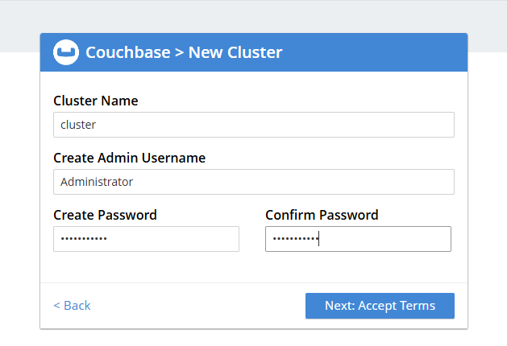
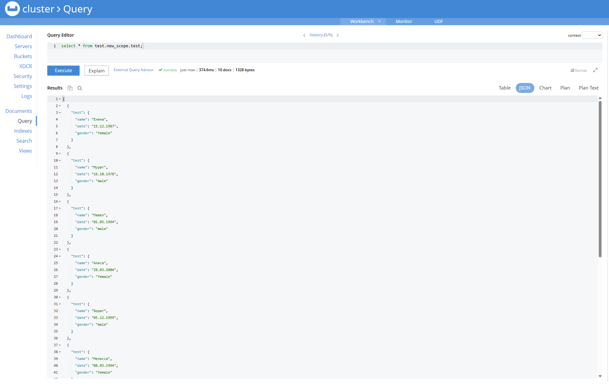

# Описание/Пошаговая инструкция выполнения домашнего задания:

* Развернуть кластер Couchbase
* Создать БД, наполнить небольшими тестовыми данными
* Проверить отказоустойчивость

## Развернуть кластер Couchbase

Развернем Couchbase server на 3х вм

```
curl -O https://packages.couchbase.com/releases/couchbase-release/couchbase-release-1.0-noarch.deb
sudo dpkg -i ./couchbase-release-1.0-noarch.deb
sudo apt-get update
sudo apt-get install couchbase-server-community
sudo systemctl start couchbase-server
```

Зайдем на первую ноду

http://158.160.105.196:8091





Присоединим все другие

http://89.169.139.231:8091
http://89.169.146.17:8091


Заходим в server и нажимаем rebalance


## Создать БД, наполнить небольшими тестовыми данными

Создаем бакет(БД), scope и коллекцию. И наполним данные (я вручную вбивала)


## Проверить отказоустойчивость

Заходим с servers и на 3ей ноде нажимаем Failover. Ребаланс.


Проверим что не смотря на это, запросы к базе проходят



Возвращаем ноду (зашла на http://89.169.146.17:8091 и сделала Join Existing Clister) и делаем ребаланс


